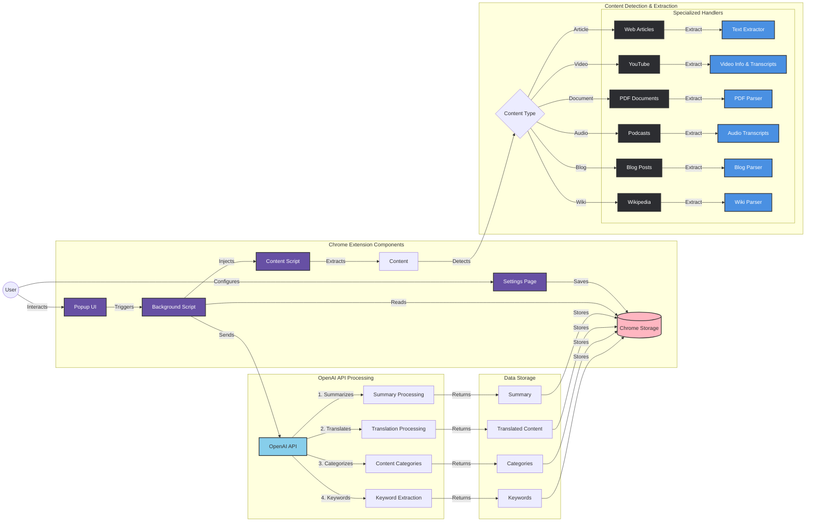
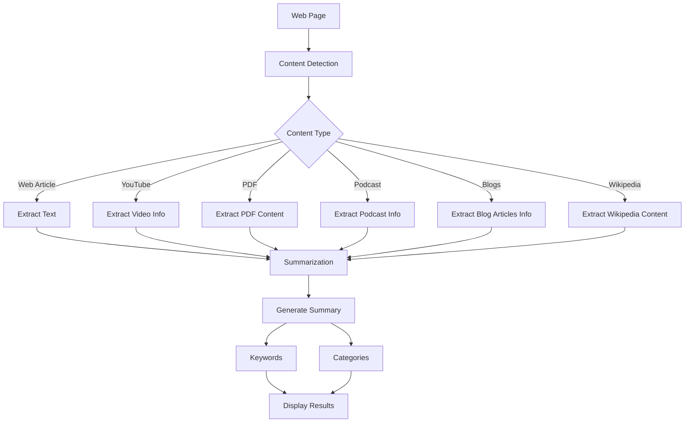

# Content Summarizer Chrome Extension

A powerful Chrome extension that summarizes web content, YouTube videos, PDFs, Podcast, Blogs, Wikipedia using OpenAI's GPT API. Get concise or detailed summaries with keyword extraction and content categorization.



## 🌟 Features

- **Smart Content Detection**: Automatically detects and processes different types of content:
  - Web Articles
  - YouTube Videos
  - PDF Documents
  - Podcast
  - Blogs
  - Wikipedia

- **Dual Summary Modes**:
  - Concise: Quick overview with key points
  - Detailed: Comprehensive analysis with more context

- **Advanced Processing**:
  - Automatic content categorization
  - Keyword extraction
  - Content type tagging
  - Save summaries for offline access

- **User-Friendly Interface**:
  - Clean, modern design
  - Dark/light theme support
  - Keyboard shortcuts
  - Copy and export options

## 🛠 Prerequisites

Before installing the extension, ensure you have:

1. Node.js (v14 or higher)
2. npm (v6 or higher)
3. Chrome browser (v88 or higher)
4. OpenAI API key

## 📥 Installation

1. **Clone the Repository**
   ```bash
   git clone https://github.com/stretchcloud/memrecall.git
   cd memcall
   ```

2. **Set Up Environment**
   ```bash
   # Install dependencies
   npm install

   # Create .env file
   cp .env.example .env
   ```

3. **Configure API Key**
   - Open `.env` file
   - Add your OpenAI API key:
     ```env
     OPENAI_API_KEY=your_api_key_here
     ```

4. **Build the Extension**
   ```bash
   npm init -y
   npm install dotenv-webpack
   npm install --save-dev @babel/preset-env babel-plugin-transform-react-jsx
   npm install marked
   npm install --save-dev @babel/core @babel/preset-react babel-loader webpack webpack-cli
   npm install react react-dom lucide-react
   npm run build
   ```

## 🚀 Loading the Extension in Chrome

1. Open Chrome and go to `chrome://extensions/`
2. Enable "Developer mode" (top-right corner)
3. Click "Load unpacked"
4. Select the extension's directory

## 💡 Usage

### Basic Usage
1. Click the extension icon in Chrome toolbar
2. Select summary mode (Concise/Detailed)
3. Click "Summarize" button

### 🌍 Translation Features
The extension supports automatic translation of summaries into multiple languages:

#### Supported Languages

- 🇪🇸 Spanish
- 🇫🇷 French
- 🇩🇪 German
- 🇮🇹 Italian
- 🇵🇹 Portuguese
- 🇷🇺 Russian
- 🇯🇵 Japanese
- 🇰🇷 Korean
- 🇨🇳 Chinese (Simplified)
  


#### Translation Settings

1. Access settings through the extension options 
2. Select your preferred target language
3. Enable/disable autosave for translated summaries
4. All new summaries will be automatically translated

#### How Translation Works

- Content is first summarized in the original language
- If a target language is selected, the summary is automatically translated
- Both original and translated versions are saved
- Switch between languages anytime

#### Note on Translation Quality

- Translations are powered by OpenAI's API
- Technical and domain-specific terms are preserved
- Context and meaning are maintained across languages

### Keyboard Shortcuts
- `Ctrl+Shift+S` (Windows/Linux) or `Cmd+Shift+S` (Mac): Open summarizer
- `Alt+S`: Summarize current page

### Features Diagram



## 🗂 Project Structure

```
memcall/
├── components/
│   ├── CategoryTree.jsx
│   ├── KeywordPills.jsx
│   └── LanguageSelector.jsx
├── content-scripts/
│   └── content.js
├── lib/
│   └── summarizer.js
├── popup/
│   ├── popup.html
│   ├── popup.js
│   └── popup.css
├── styles/
│   └── library.css
├── .env.example
├── config.js
├── background.js
├── manifest.json
└── webpack.config.js
```

## ⚙️ Configuration

The extension can be configured through:
1. Options page (accessible via extension menu)
2. `.env` file for API configuration
3. `manifest.json` for extension settings

## 🔄 Development Workflow

1. Make changes to source files
2. Run build command:
   ```bash
   npm run build
   ```
3. Reload extension in Chrome:
   - Go to `chrome://extensions/`
   - Find your extension
   - Click the reload icon

## 🧪 Testing

1. **Different Content Types**
   - Test with various websites
   - Try different YouTube videos
   - Test with PDF documents

2. **Features Testing**
   - Try both summary modes
   - Check keyword extraction
   - Verify content categorization
   - Test save/export functionality

## ⚠️ Troubleshooting

Common issues and solutions:

1. **Extension Not Loading**
   - Check if developer mode is enabled
   - Verify build was successful
   - Check console for errors

2. **API Errors**
   - Verify API key in `.env`
   - Check API rate limits
   - Ensure correct API endpoint

3. **Content Not Summarizing**
   - Check console for errors
   - Verify content script injection
   - Check page compatibility

## 📝 Contributing

1. Fork the repository
2. Create your feature branch
3. Commit your changes
4. Push to the branch
5. Create a Pull Request

## 📄 License

This project is licensed under the MIT License - see the LICENSE file for details.

## 🙏 Acknowledgments

- OpenAI for GPT API
- Chrome Extensions Documentation
- React and related libraries

